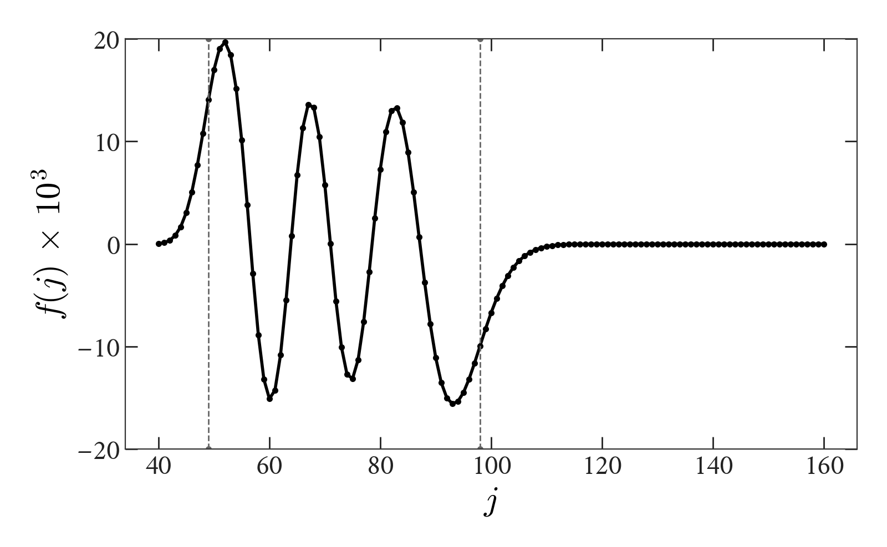

# WignerFamilies

This implements the methods described in [Luscombe and Luban 1998](https://journals.aps.org/pre/abstract/10.1103/PhysRevE.57.7274) for generating families of Wigner 3j and 6j symbols by recurrence relation. 

