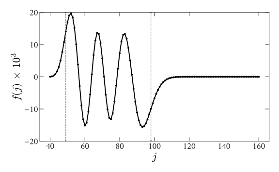

# WignerFamilies

[](https://xzackli.github.io/WignerFamilies.jl/dev)
[](https://github.com/xzackli/WignerFamilies.jl/actions)
[](https://codecov.io/gh/xzackli/WignerFamilies.jl)
<!--  -->
<!-- [](https://xzackli.github.io/WignerFamilies.jl/stable) -->

This package implements methods described in [Luscombe and Luban 1998](https://journals.aps.org/pre/abstract/10.1103/PhysRevE.57.7274), based on the work of [Schulten and Gordon 1961](https://aip.scitation.org/doi/10.1063/1.522426), for generating families of Wigner 3j and 6j symbols by recurrence relation. It also contains code implementing the magic square methods for efficiently storing Wigner 3j symbols in [Rasch and Yu 2012](https://epubs.siam.org/doi/abs/10.1137/S1064827503422932).

## Installation

```julia
using Pkg
Pkg.add("git@github.com:xzackli/WignerFamilies.jl.git")
```

## Usage
WignerFamilies.jl currently computes the nontrivial 3j symbols over `j`, with the other 
quantum numbers fixed, in the family of symbols,

<p align="center">

</p>

It exposes `wigner3j_f(j₂, j₃, m₂, m₃)` which returns a simple wrapper around a vector of 
the type`WignerSymbolVector`. This vector contains the computed symbols, indexed by the 
quantum number `j`. The type supports 
[half-integer](https://github.com/sostock/HalfIntegers.jl) quantum numbers as indices.

```julia
using WignerFamilies

# wigner3j for all j₁ fixing j₂=100, j₃=60, m₂=70, m₃=-55, m₁=-m₂-m₃
w3j = wigner3j_f(100, 60, 70, -55)  # you can get the underling array with w3j.symbols
js = collect(eachindex(w3j))
plot(js, w3j.symbols)
```

This generates the symbols in Figure 1 of Luscombe and Luban 1998.
<p align="center">

</p>

